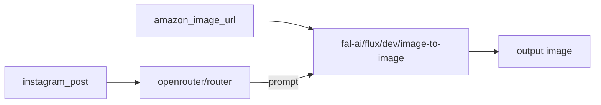

# HotProducts Instagram → FAL Workflow

Pipeline for [@hotproducts.online](https://www.instagram.com/hotproducts.online): Instagram post captions drive the img2img prompt; each product's **Amazon product image** is a workflow variable.

## Quick start (no FAL workflow UI required)

Set `FAL_KEY` in repo-root `.env`, then:

```bash
python instagram/fal-workflow/run_batch.py --slug vitamix-7500
```

That runs the same LLM → img2img pipeline directly. You do **not** need to create or import a workflow in [fal.ai/workflows/new](https://fal.ai/workflows/new) for this.

The JSON file + FAL UI are only needed if you want a visual editor or `--mode saved`.

## Files

| File | Purpose |
|------|---------|
| `hotproducts-instagram-ad-creative.json` | Import into [fal.ai/workflows/new](https://fal.ai/workflows/new) |
| `products.json` | 7 feed products with `instagram_post` + `amazon_image_url` presets |
| `build_products.py` | Rebuild `products.json` from `site/public/instagram-feed/` + catalog |
| `run_batch.py` | Run pipeline via direct model calls or saved workflow (needs `FAL_KEY`) |
| `list_workflows.py` | List your saved FAL workflow endpoints |

## Workflow graph



1. **LLM** (`openrouter/router`) — reads the Instagram caption, outputs a photorealistic img2img prompt (HotProducts brand: dark charcoal + orange glow, no in-image text).
2. **Img2img** (`fal-ai/flux/dev/image-to-image`) — uses `amazon_image_url` as base image, `strength=0.35` (same as `ad_creative_gen.py`).
3. **Output** — generated banner URL + prompt text.

## Import into FAL UI (optional)

Only needed for `--mode saved` or manual runs in the FAL editor.

1. Open [https://fal.ai/workflows/new](https://fal.ai/workflows/new)
2. Use **Import** (or paste JSON if the editor supports it) with `hotproducts-instagram-ad-creative.json`
3. Save as `hotproducts-instagram-ad-creative`
4. Pick a product from `products.json` and fill the two input variables:
   - `instagram_post` — full caption
   - `amazon_image_url` — `m.media-amazon.com` URL

## Product presets (7)

From `site/public/instagram-feed/`:

| Slug | Amazon image variable |
|------|----------------------|
| `amazon-echo-show-15-smart-display` | `products[0].amazon_image_url` |
| `canon-eos-r5-camera` | `products[1].amazon_image_url` |
| `concept2-rowerg-rowing-machine` | `products[2].amazon_image_url` |
| `elac-debut-2-0-b6-2-bookshelf-speakers` | `products[3].amazon_image_url` |
| `hp-omen-45l-rtx-5080-gaming-desktop` | `products[4].amazon_image_url` |
| `vitamix-7500` | `products[5].amazon_image_url` |
| `zeiss-otus-85mm-f-1-4` | `products[6].amazon_image_url` |

Regenerate after new feed images:

```bash
python instagram/fal-workflow/build_products.py
```

## Run via API

```bash
# Preview inputs (no FAL charges)
python instagram/fal-workflow/run_batch.py --dry-run

# Single product — direct model chain (default; same graph as the FAL UI workflow)
python instagram/fal-workflow/run_batch.py --slug vitamix-7500

# All products (requires FAL_KEY in repo-root .env)
python instagram/fal-workflow/run_batch.py

# After saving the workflow in the FAL UI, discover your endpoint:
python instagram/fal-workflow/list_workflows.py

# Then call the saved workflow (use the endpoint printed by list_workflows):
python instagram/fal-workflow/run_batch.py --mode saved \
  --workflow-endpoint "workflows/ACTUAL_NICKNAME/hotproducts-instagram-ad-creative" \
  --slug vitamix-7500
```

**Note:** Inline `workflows/execute` from the [FAL JS docs](https://fal.ai/docs/examples/integrations/custom-workflow-ui) is not available via Python `fal_client`. Use `--mode direct` (equivalent pipeline) or `--mode saved` after importing the JSON in the FAL UI.
